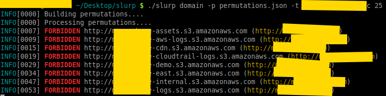
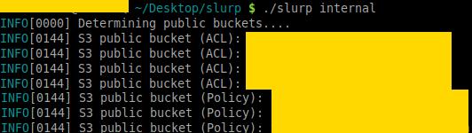

# slurp
Blackbox/whitebox S3 bucket enumerator

## Overview
- Credit to all the vendor packages that made this tool possible.
- This is a security tool; it's meant for pen-testers and security professionals to perform audits of s3 buckets.
- This is the exact same project that was features in [SANS Newsbites](https://www.sans.org/newsletters/newsbites/xix/95)

### Features
- Scan via domain(s); you can target a single domain or a list of domains
- Scan via keyword(s); you can target a single keyword or a list of keywords
- Scan via AWS credentials; you can target your own AWS account to see which buckets have been exposed
- Colorized output for visual grep
- Currently generates over 28,000 permutations per domain and keyword (thanks to @jakewarren and @random-robbie)
- Punycode support for internationalized domains
- Strong copyleft license (GPLv3)

## Modes
There are two modes that this tool operates at; blackbox and whitebox mode. Whitebox mode (or `internal`) is significantly faster than blackbox (external) mode. Blackbox mode (or `domain|keyword` modes) operates by taking a permutation and scanning over the internet. This way is entirely dependent on the permutations list. You also cannot link (but can infer) which account the public bucket may belong to. **Do not open issues asking how to figure this out**; only amazon knows and the account holder.

`internal` mode works by using AWS credentials and scanning buckets that the account has access to. This method doesn't require the permutations list and is **significantly** faster. You also know which buckets the account belongs to (as you have to use AWS credentials to conduct the scan). In this mode, you are using the AWS API **with credentials** on a specific account *that you own* to see what is open. This method pulls all S3 buckets and checks Policy/ACL permissions. Note that, I will not provide support on how to use the AWS API. Your credentials should be in `~/.aws/credentials`.

### `domain` (external)


### `keyword` (external)


### internal


## Usage
- `slurp domain <-t|--target> example.com` will enumerate the S3 domains for a specific target.
- `slurp keyword <-t|--target> linux,golang,python` will enumerate S3 buckets based on those 3 key words.
- `slurp internal` performs an internal scan using the AWS API.
- `slurp <domain|keyword> <-t|--target> example.com -g` export the permutation list to a file; by default its `./generated`. Use `--generate_file` to change the path/name.

### What about `slurp internal` with different profiles?
It is entirely possible that you'll experience the following error:

```
ERRO[0003] NoCredentialProviders: no valid providers in chain. Deprecated.
	For verbose messaging see aws.Config.CredentialsChainVerboseErrors
```

This error can be thrown if you have profile based setup for `~/.aws/` (no default); you can get around this by running with `AWS_PROFILE=x slurp internal`. Amazons [Named Profiles](https://docs.aws.amazon.com/cli/latest/userguide/cli-configure-profiles.html) documentation sheds more light onto this issue.

## Installation
This project uses `vgo`; you can clone and `go build` or download from Releases section. **Please do not open issues on why you cannot build the project**; this project builds like any other project would in Go, if you cannot build then I strongly suggest you read the [go spec](https://golang.org/ref/spec).

Also, I do not regularly release binaries and the only binaries I'm including are `linux/amd64`. If you want mac/windows binaries, you'll have to build them yourself. Also note that this software is meant to run in Linux; I have no intention on building for Windows or Mac or supporting for those platforms. While you can build and run on those platforms no support will be provided.

## Contributors
- Thanks to @jakewarren and @random-robbie for permutations list(s).
- Thanks to [Yvonni Fhang](https://www.instagram.com/yvonnifhang/) for the logo.
